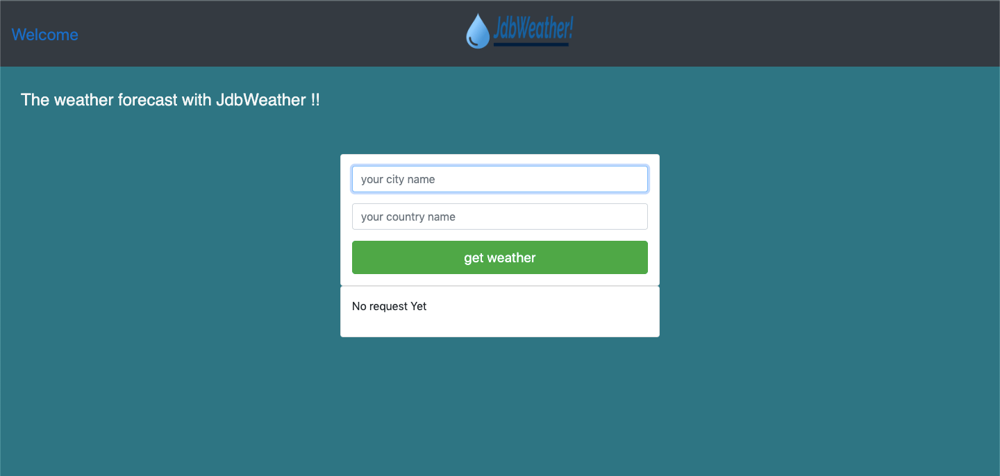

# Weather-app

A simple website that shows information about the climate.☀🌦

## Table of contents

- [General info](#general-info)
- [Screenshots](#screenshots)
- [Technologies](#technologies)
- [Contact](#contact)

## General info

A simple website that shows information about the climate of the country and the city you want. 💧

## Screenshots

## Technologies

- Html
- Css
- Javascript
- ReactJS

## view project

[weather app](https://jhosep98.github.io/Weather-con-Reactjs/)

## Contact

Created by [@jhosep98](https://jhosep98.github.io/Portfolio2020jdb/) - feel free to contact me!
